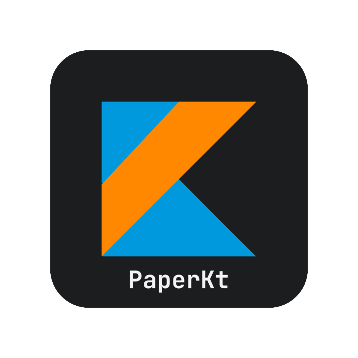

# PaperKt — an elegant API for Kotlin plugins development targeting Paper.

The goal of this project is to provide a simple and elegant API for Kotlin plugins development targeting Paper, so that
it is as easy to develop fully featured Kotlin plugins as it is with Java plugins.

## Structure

This project is divided into multiple modules:

- [Core](core) — the core module containing the most basic functionality, can be bundled with your plugins.
- [Library](library) — the Paper plugin that bundles all the modules with it, can be used as a dependency in your
  plugins.

And more modules that will come later in the future:

- [Commands](commands) — a module containing a simple and elegant yet rich API for commands.
- [Config](config) — a module containing a simple and elegant yet rich API for configuration files.
- [Database](database) — a module containing a simple and elegant yet rich API for databases.

## Contribution

Your contributions are welcome!

## Quick Start

Clone the [plugin template](https://github.com/eyrond/paperkt-template) repository for a quick start.

Refer to the respective module for further information, or take a look at
the [Wiki](https://github.com/eyrond/paperkt/wiki).
